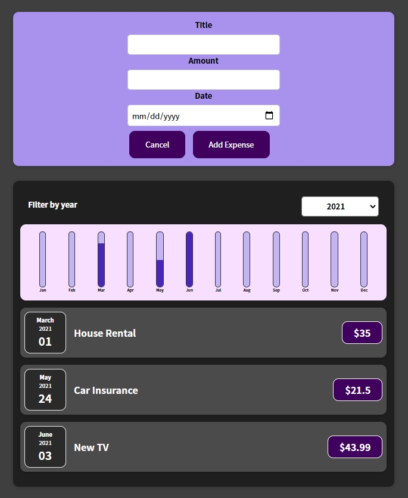

# Expense recorder App :clipboard:

## Lessons Learned

- React Basics & Working With Components
- React State & Working with Events
- Rendering Lists & Conditional Content

## Demo

[**Project**](https://expense-recorder-react.netlify.app/) created in a Udemy course of [React.js](https://www.udemy.com/course/react-the-complete-guide-incl-redux/)
  
## Screenshot



  
## Run Locally

Clone the project

```bash
  git clone https://github.com/Pablo-MC/expense-recorder.git
```

Install dependencies

```bash
  npm install
```

Start the server

```bash
  npm start
```

  
